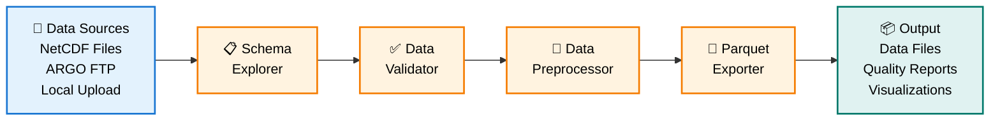
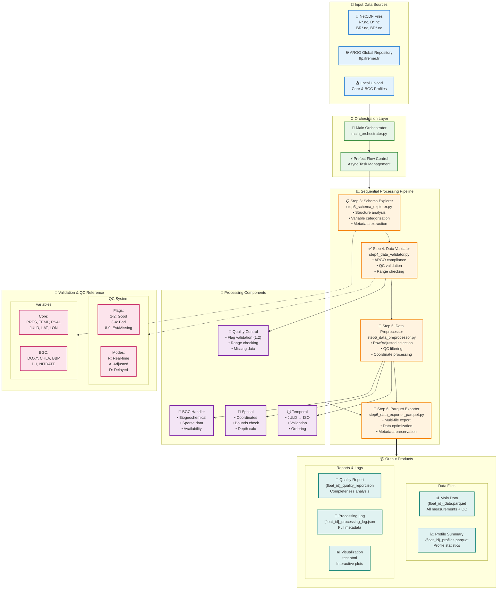
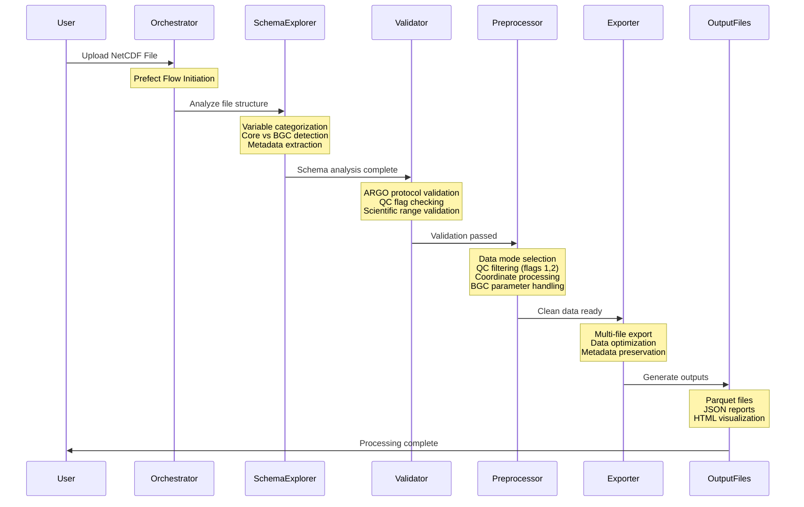
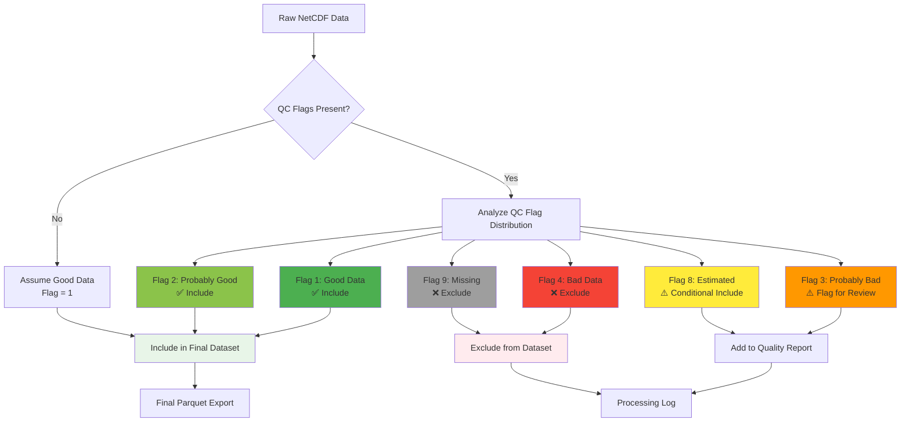
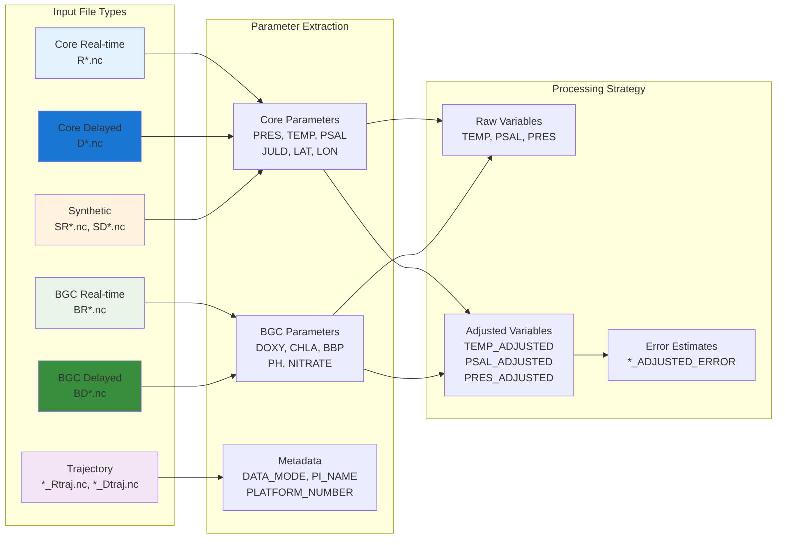

# DATAOPS Pipeline Architecture Diagram

## Complete DATAOPS Pipeline Flow

```mermaid
graph LR
    %% Input
    INPUT["📁 Data Sources<br/>NetCDF Files<br/>ARGO FTP<br/>Local Upload"] 

    %% Processing Steps
    EXPLORE["📋 Schema<br/>Explorer"] 
    VALIDATE["✅ Data<br/>Validator"]
    PROCESS["🔧 Data<br/>Preprocessor"]
    EXPORT["💾 Parquet<br/>Exporter"]

    %% Output
    OUTPUT["📦 Output<br/>Data Files<br/>Quality Reports<br/>Visualizations"]

    %% Flow
    INPUT --> EXPLORE
    EXPLORE --> VALIDATE 
    VALIDATE --> PROCESS
    PROCESS --> EXPORT
    EXPORT --> OUTPUT

    %% Styling
    classDef inputStyle fill:#e3f2fd,stroke:#1976d2,stroke-width:2px,color:#000
    classDef processStyle fill:#fff3e0,stroke:#f57c00,stroke-width:2px,color:#000
    classDef outputStyle fill:#e0f2f1,stroke:#00796b,stroke-width:2px,color:#000

    class INPUT inputStyle
    class EXPLORE,VALIDATE,PROCESS,EXPORT processStyle
    class OUTPUT outputStyle
```

```mermaid
graph TB
    %% Input Data Sources
    subgraph INPUT["🔵 Input Data Sources"]
        NETCDF["📁 NetCDF Files<br/>R*.nc, D*.nc<br/>BR*.nc, BD*.nc"]
        ARGO_FTP["🌐 ARGO Global Repository<br/>ftp.ifremer.fr"]
        LOCAL_FILES["📤 Local Upload<br/>Core & BGC Profiles"]
    end

    %% Main Orchestration
    subgraph ORCHESTRATION["⚙️ Orchestration Layer"]
        ORCHESTRATOR["🎯 Main Orchestrator<br/>main_orchestrator.py"]
        FLOW_CONTROL["⚡ Prefect Flow Control<br/>Async Task Management"]
    end

    %% Sequential Pipeline
    subgraph PIPELINE["📊 Sequential Processing Pipeline"]
        direction TB
        STEP3["📋 Step 3: Schema Explorer<br/>step3_schema_explorer.py<br/>• Structure analysis<br/>• Variable categorization<br/>• Metadata extraction"]
        
        STEP4["✅ Step 4: Data Validator<br/>step4_data_validator.py<br/>• ARGO compliance<br/>• QC validation<br/>• Range checking"]
        
        STEP5["🔧 Step 5: Data Preprocessor<br/>step5_data_preprocessor.py<br/>• Raw/Adjusted selection<br/>• QC filtering<br/>• Coordinate processing"]
        
        STEP6["💾 Step 6: Parquet Exporter<br/>step6_data_exporter_parquet.py<br/>• Multi-file export<br/>• Data optimization<br/>• Metadata preservation"]
        
        STEP3 --> STEP4
        STEP4 --> STEP5
        STEP5 --> STEP6
    end

    %% Processing Components
    subgraph PROCESSORS["🔬 Processing Components"]
        direction LR
        QC_ENGINE["🎯 Quality Control<br/>• Flag validation (1,2)<br/>• Range checking<br/>• Missing data"]
        
        TEMPORAL["🕐 Temporal<br/>• JULD → ISO<br/>• Validation<br/>• Ordering"]
        
        SPATIAL["📍 Spatial<br/>• Coordinates<br/>• Bounds check<br/>• Depth calc"]
        
        BGC_HANDLER["🧪 BGC Handler<br/>• Biogeochemical<br/>• Sparse data<br/>• Availability"]
    end

    %% Validation & QC Reference
    subgraph VALIDATION["📏 Validation & QC Reference"]
        direction LR
        subgraph VARS["Variables"]
            CORE_VARS["Core:<br/>PRES, TEMP, PSAL<br/>JULD, LAT, LON"]
            BGC_VARS["BGC:<br/>DOXY, CHLA, BBP<br/>PH, NITRATE"]
        end
        
        subgraph QC_REF["QC System"]
            QC_FLAGS["Flags:<br/>1-2: Good<br/>3-4: Bad<br/>8-9: Est/Missing"]
            DATA_MODES["Modes:<br/>R: Real-time<br/>A: Adjusted<br/>D: Delayed"]
        end
    end

    %% Output Products
    subgraph OUTPUT["📦 Output Products"]
        direction TB
        subgraph DATA_OUT["Data Files"]
            MAIN_DATA["📊 Main Data<br/>{float_id}_data.parquet<br/>All measurements + QC"]
            PROFILE_SUMMARY["📈 Profile Summary<br/>{float_id}_profiles.parquet<br/>Profile statistics"]
        end
        
        subgraph REPORTS["Reports & Logs"]
            QUALITY_REPORT["📝 Quality Report<br/>{float_id}_quality_report.json<br/>Completeness analysis"]
            PROCESSING_LOG["📜 Processing Log<br/>{float_id}_processing_log.json<br/>Full metadata"]
            TEST_HTML["📊 Visualization<br/>test.html<br/>Interactive plots"]
        end
    end

    %% Main Flow Connections
    INPUT --> ORCHESTRATOR
    ORCHESTRATOR --> FLOW_CONTROL
    FLOW_CONTROL --> PIPELINE

    %% Pipeline to Processors connections
    STEP3 -.-> VARS
    STEP4 -.-> QC_REF
    STEP4 --> QC_ENGINE
    STEP5 --> TEMPORAL
    STEP5 --> SPATIAL
    STEP5 --> BGC_HANDLER

    %% Processors to Export
    PROCESSORS --> STEP6

    %% Export to Outputs
    STEP6 ==> OUTPUT

    %% Styling
    classDef inputStyle fill:#e3f2fd,stroke:#1976d2,stroke-width:2px
    classDef orchStyle fill:#e8f5e9,stroke:#388e3c,stroke-width:2px
    classDef pipeStyle fill:#fff3e0,stroke:#f57c00,stroke-width:2px
    classDef procStyle fill:#f3e5f5,stroke:#7b1fa2,stroke-width:2px
    classDef valStyle fill:#fce4ec,stroke:#c2185b,stroke-width:2px
    classDef outStyle fill:#e0f2f1,stroke:#00796b,stroke-width:2px

    class NETCDF,ARGO_FTP,LOCAL_FILES inputStyle
    class ORCHESTRATOR,FLOW_CONTROL orchStyle
    class STEP3,STEP4,STEP5,STEP6 pipeStyle
    class QC_ENGINE,TEMPORAL,SPATIAL,BGC_HANDLER procStyle
    class CORE_VARS,BGC_VARS,QC_FLAGS,DATA_MODES valStyle
    class MAIN_DATA,PROFILE_SUMMARY,QUALITY_REPORT,PROCESSING_LOG,TEST_HTML outStyle
```

## Detailed Processing Flow

```mermaid
sequenceDiagram
    participant User
    participant Orchestrator
    participant SchemaExplorer
    participant Validator
    participant Preprocessor
    participant Exporter
    participant OutputFiles

    User->>Orchestrator: Upload NetCDF File

    Note over Orchestrator: Prefect Flow Initiation
    Orchestrator->>SchemaExplorer: Analyze file structure

    Note over SchemaExplorer: Variable categorization<br/>Core vs BGC detection<br/>Metadata extraction
    SchemaExplorer->>Validator: Schema analysis complete

    Note over Validator: ARGO protocol validation<br/>QC flag checking<br/>Scientific range validation
    Validator->>Preprocessor: Validation passed

    Note over Preprocessor: Data mode selection<br/>QC filtering (flags 1,2)<br/>Coordinate processing<br/>BGC parameter handling
    Preprocessor->>Exporter: Clean data ready

    Note over Exporter: Multi-file export<br/>Data optimization<br/>Metadata preservation
    Exporter->>OutputFiles: Generate outputs

    Note over OutputFiles: Parquet files<br/>JSON reports<br/>HTML visualization
    OutputFiles->>User: Processing complete
```

## QC Flag Processing Logic

```mermaid
flowchart TD
    START[Raw NetCDF Data] --> CHECK_QC{QC Flags Present?}

    CHECK_QC -->|Yes| ANALYZE_FLAGS[Analyze QC Flag Distribution]
    CHECK_QC -->|No| ASSUME_GOOD[Assume Good Data<br/>Flag = 1]

    ANALYZE_FLAGS --> FLAG_1[Flag 1: Good Data<br/>✅ Include]
    ANALYZE_FLAGS --> FLAG_2[Flag 2: Probably Good<br/>✅ Include]
    ANALYZE_FLAGS --> FLAG_3[Flag 3: Probably Bad<br/>⚠️ Flag for Review]
    ANALYZE_FLAGS --> FLAG_4[Flag 4: Bad Data<br/>❌ Exclude]
    ANALYZE_FLAGS --> FLAG_8[Flag 8: Estimated<br/>⚠️ Conditional Include]
    ANALYZE_FLAGS --> FLAG_9[Flag 9: Missing<br/>❌ Exclude]

    FLAG_1 --> INCLUDE_DATA[Include in Final Dataset]
    FLAG_2 --> INCLUDE_DATA
    ASSUME_GOOD --> INCLUDE_DATA

    FLAG_3 --> QUALITY_REPORT[Add to Quality Report]
    FLAG_8 --> QUALITY_REPORT

    FLAG_4 --> EXCLUDE_DATA[Exclude from Dataset]
    FLAG_9 --> EXCLUDE_DATA

    INCLUDE_DATA --> FINAL_PARQUET[Final Parquet Export]
    QUALITY_REPORT --> PROCESSING_LOG[Processing Log]
    EXCLUDE_DATA --> PROCESSING_LOG

    style FLAG_1 fill:#4caf50
    style FLAG_2 fill:#8bc34a
    style FLAG_3 fill:#ff9800
    style FLAG_4 fill:#f44336
    style FLAG_8 fill:#ffeb3b
    style FLAG_9 fill:#9e9e9e
    style INCLUDE_DATA fill:#e8f5e8
    style EXCLUDE_DATA fill:#ffebee
```

## Data Type Processing Flow

```mermaid
graph LR
    subgraph "Input File Types"
        CORE_R[Core Real-time<br/>R*.nc]
        CORE_D[Core Delayed<br/>D*.nc]
        BGC_R[BGC Real-time<br/>BR*.nc]
        BGC_D[BGC Delayed<br/>BD*.nc]
        SYNTHETIC[Synthetic<br/>SR*.nc, SD*.nc]
        TRAJECTORY[Trajectory<br/>*_Rtraj.nc, *_Dtraj.nc]
    end

    subgraph "Parameter Extraction"
        CORE_PARAMS[Core Parameters<br/>PRES, TEMP, PSAL<br/>JULD, LAT, LON]
        BGC_PARAMS[BGC Parameters<br/>DOXY, CHLA, BBP<br/>PH, NITRATE]
        META_PARAMS[Metadata<br/>DATA_MODE, PI_NAME<br/>PLATFORM_NUMBER]
    end

    subgraph "Processing Strategy"
        RAW_VARS[Raw Variables<br/>TEMP, PSAL, PRES]
        ADJUSTED_VARS[Adjusted Variables<br/>TEMP_ADJUSTED<br/>PSAL_ADJUSTED<br/>PRES_ADJUSTED]
        ERROR_VARS[Error Estimates<br/>*_ADJUSTED_ERROR]
    end

    CORE_R --> CORE_PARAMS
    CORE_D --> CORE_PARAMS
    BGC_R --> BGC_PARAMS
    BGC_D --> BGC_PARAMS
    SYNTHETIC --> CORE_PARAMS
    TRAJECTORY --> META_PARAMS

    CORE_PARAMS --> RAW_VARS
    CORE_PARAMS --> ADJUSTED_VARS
    BGC_PARAMS --> RAW_VARS
    BGC_PARAMS --> ADJUSTED_VARS

    ADJUSTED_VARS --> ERROR_VARS

    style CORE_R fill:#e3f2fd
    style CORE_D fill:#1976d2
    style BGC_R fill:#e8f5e8
    style BGC_D fill:#388e3c
    style SYNTHETIC fill:#fff3e0
    style TRAJECTORY fill:#f3e5f5
```