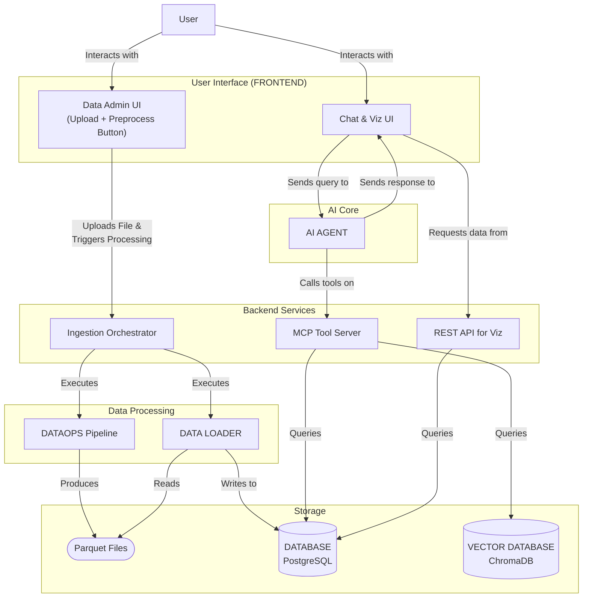

# FloatChat Brownfield Enhancement Architecture

This document outlines the architectural approach for enhancing the existing `sih25/DATAOPS` pipeline into the full **FloatChat** application, as defined in the Product Requirements Document (PRD).

## Section 1: Introduction & Analysis

### Introduction

This document's primary goal is to serve as the guiding architectural blueprint for the AI-driven development of the conversational interface, visualization dashboard, and API layer, ensuring seamless and reliable integration with the existing data processing system.

A core architectural challenge is the safe integration of an AI agent with the scientific database. Key considerations include:
*   **Mitigating AI Inaccuracy:** Ensuring that natural language queries are translated into scientifically valid database queries that respect ARGO data protocols.
*   **Large Dataset Handling:** Implementing server-side processing and summarization to manage large query results, preventing system overload and providing a responsive user experience.
*   **Tool-Based Agency:** Strictly defining the AI agent's capabilities through a well-designed toolbox of server-side functions (MCPs) to ensure reliability and control.

### Existing Project Analysis

*   **Primary Purpose:** The existing code in `sih25/DATAOPS/` is a data processing pipeline designed to ingest, validate, preprocess, and export oceanographic data from NetCDF files into Parquet format.
*   **Current Tech Stack:** The pipeline is written in Python, utilizing libraries like Pandas and Xarray within an environment managed by `uv`.
*   **Architecture Style:** The current architecture is a sequential, multi-step data pipeline, executed via the `main_orchestrator.py` script.
*   **Deployment Method:** The deployment method appears to be a local, script-based execution.
*   **Identified Constraints & Risks:**
    *   The system must gracefully handle large query results via server-side summarization.
    *   The AI-to-database query process must be mediated by trusted, human-written tools that enforce scientific data rules (e.g., quality flags).
    *   The AI agent's capabilities are strictly limited by its available server-side tools; a comprehensive toolbox must be developed.

## Section 2: Enhancement Scope and Integration Strategy

*   **Code Integration:** The new components (FastAPI backend, Plotly Dash frontend) will be new Python applications within the `sih25/` directory. They will trigger the `DATAOPS` pipeline as a process but will primarily interact with the data via the PostgreSQL `DATABASE`.
*   **Database Integration:** The `DATAOPS` pipeline's output will be used to populate a PostgreSQL `DATABASE` (managed by Supabase). This `DATABASE` will become the central source of truth for the application.
*   **API Integration:** A new FastAPI backend will serve as the `API / MCP SERVER` layer, exposing secure, tool-based endpoints for the `AI AGENT` and providing data to the `FRONTEND`.
*   **UI Integration:** A new Plotly Dash application will provide the chat interface and visualization dashboard, interacting with the `API / MCP SERVER`.

## Section 3: Tech Stack

#### Existing Technology Stack

| Category | Current Technology | Version | Usage in Enhancement |
| :--- | :--- | :--- | :--- |
| `DATA PIPELINE` | Python | >=3.9 | Core language for all components |
| `DATA PIPELINE` | Xarray, Pandas | >=2024.1, >=2.0 | Continue as primary libraries for NetCDF reading and data manipulation |

#### New Technology Additions

| Technology | Purpose | Rationale |
| :--- | :--- | :--- |
| FastAPI | `BACKEND / API` | To create the robust, async-capable MCP server that exposes tools to the AI Agent and serves data to the FRONTEND. |
| Plotly Dash | `FRONTEND` | To build the interactive two-column dashboard with the chat interface and data visualizations, as specified in the PRD. |
| PostgreSQL | `DATABASE` | To provide a scalable, structured data store for the oceanographic data, enabling complex queries. (Managed via Supabase). |
| ChromaDB | `VECTOR DATABASE` | To store embeddings of profile metadata for efficient semantic search, powering the RAG pipeline. |
| AGNO/MCP | `AI FRAMEWORK` | The core AI agent framework for managing conversation, memory, and tool use, as specified in the PRD. |
| Pipecat | `VOICE` | To provide the voice-to-text and text-to-voice functionality for hands-free interaction. |

## Section 4: Data Models and Schema Changes

#### New Data Models

**1. `floats`**
*   **Purpose:** To store the metadata for each unique ARGO float.
*   **Key Attributes:** `wmo_id` (PK), `deployment_info`, `pi_details`.
*   **Relationships:** One-to-many with the `profiles` table.

**2. `profiles`**
*   **Purpose:** To store information for each individual measurement cycle.
*   **Key Attributes:** `profile_id` (PK), `float_wmo_id` (FK), `timestamp`, `position`.
*   **Relationships:** Many-to-one with `floats`, One-to-many with `observations`.

**3. `observations`**
*   **Purpose:** To store the actual scientific measurements.
*   **Key Attributes:** `observation_id` (PK), `profile_id` (FK), `depth`, `parameter`, `value`, `qc_flag`.
*   **Relationships:** Many-to-one with `profiles`.

#### Schema Integration Strategy

*   **New Tables:** `floats`, `profiles`, `observations`.
*   **New Indexes:** On foreign keys, `profiles.timestamp`, `observations.parameter`, and a spatial index on `profiles.position`.
*   **Migration Strategy:** A **new downstream process (`DATA LOADER`)** will be created. This process will read the clean Parquet files generated by the `DATAOPS` pipeline and load the data into the Supabase PostgreSQL `DATABASE`.

## Section 5: Component Architecture

#### Component Descriptions

*   **`API / MCP SERVER`:** A FastAPI application that orchestrates data ingestion, acts as the MCP Server for the `AI AGENT`, and provides a REST `API` for the `FRONTEND`.
*   **`FRONTEND`:** A Plotly Dash application with two areas: a Data Administration UI for file uploads, and a Conversational Analysis UI for chat and visualizations.

#### Component Interaction Diagram


## Section 6: API Design and Integration

*   **`POST /api/v1/ingest/upload`**: Receives a NetCDF file and triggers the data ingestion workflow.
*   **`POST /api/v1/agent/chat`**: Primary endpoint for the `FRONTEND` to send user messages to the `AI AGENT`.
*   **`POST /api/v1/agent/tool_call`**: Internal endpoint for the `AI AGENT` to execute tools on the MCP Server.

## Section 7: External API Integration

*   **Supabase API:** Provides the core PostgreSQL `DATABASE`.
*   **Pipecat API:** Provides real-time voice-to-text and text-to-voice processing.
*   **ChromaDB API:** Provides the `VECTOR DATABASE` for semantic search.

## Section 8: Source Tree

```plaintext
sih25/
├── API/
├── AGENT/
├── FRONTEND/
├── LOADER/
└── DATAOPS/
```

## Section 9: Infrastructure and Deployment Integration

*   **Deployment Approach:** Container-based deployment using Docker. The `DATABASE` is on Supabase, while the `API` and `FRONTEND` are deployed as separate services on a PaaS (e.g., Render, Fly.io).
*   **CI/CD:** A GitHub Actions pipeline will automate building and deploying Docker images.
*   **Rollback:** Handled via the PaaS provider's ability to redeploy a previous Docker image tag.

## Section 10: Coding Standards

*   **Code Style:** Black
*   **Linting:** Flake8, isort
*   **Testing:** Pytest
*   **Docstrings:** Google Python Style Guide
*   **Validation:** Pydantic for all `API` models.

## Section 11: Testing Strategy

*   **Framework:** Pytest with `pytest-asyncio` and `pytest-cov` (80% coverage target).
*   **Unit Tests:** For all individual components (`API` endpoints, `AGENT` logic, `LOADER` logic, Dash callbacks).
*   **Integration Tests:** To verify the flows between components (`DATAOPS` -> `LOADER` -> `DATABASE`, `AGENT` <-> `API`, `FRONTEND` <-> `API`).
*   **Regression Tests:** The full test suite will be run on every pull request via CI/CD.

## Section 12: Security Integration

*   **Secrets Management:** All secrets must be loaded from environment variables.
*   **Input Validation:** Pydantic models will be used for all `API` inputs.
*   **Agent Sandboxing:** The `AI AGENT` will have no direct system access and must use the tools on the `API / MCP SERVER`.
*   **Transport Security:** Enforce HTTPS for all traffic.
*   **Testing:** Use Dependabot for vulnerability scanning and pre-commit hooks to prevent committing secrets.

## Section 13: Checklist Results Report

*   **Requirements Alignment:** PASS
*   **Architecture Fundamentals:** PASS
*   **Technical Stack & Decisions:** PASS
*   **Resilience & Operational Readiness:** PASS
*   **Security & Compliance:** PASS
*   **Implementation Guidance:** PASS

