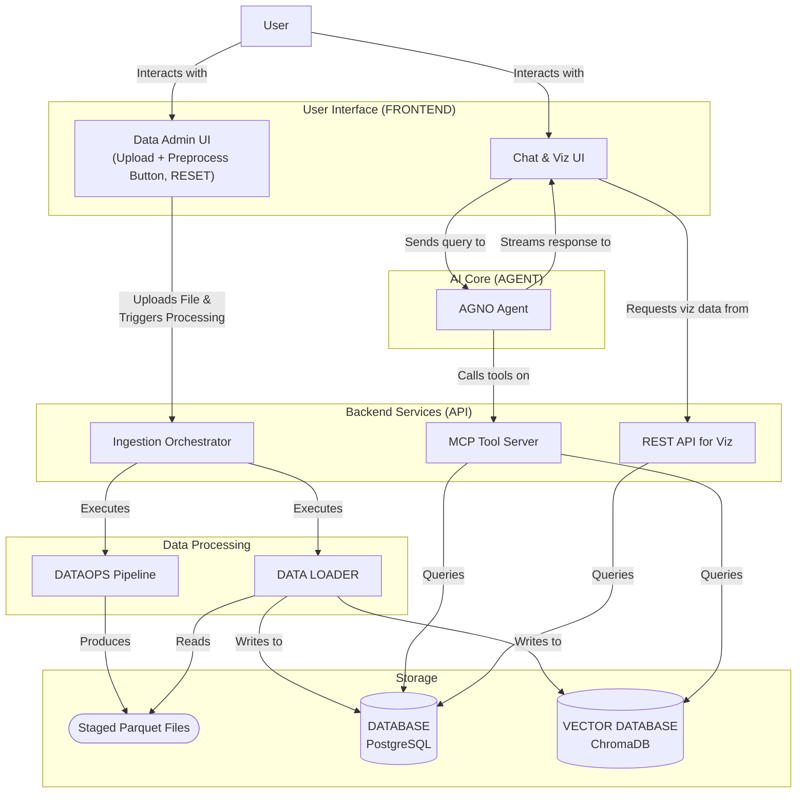

# Product Requirements Document: FloatChat

**Version:** 1.0
**Date:** 2025-09-16
**Status:** Final

## 1. Executive Summary

FloatChat is an AI-powered conversational interface designed to democratize access to ARGO ocean data for oceanographers, researchers, and decision-makers. The system transforms complex NetCDF oceanographic datasets into an intuitive chat-based discovery and visualization platform, enabling natural language queries like "Show me salinity profiles near the equator in March 2023" to generate instant insights and interactive visualizations.

Built for the Smart India Hackathon 2025, FloatChat addresses the critical challenge identified by the Ministry of Earth Sciences (MoES) and Indian National Centre for Ocean Information Services (INCOIS): making vast, heterogeneous oceanographic data accessible to non-technical users while maintaining scientific accuracy and supporting advanced analytics.

The solution combines a modern data engineering pipeline (NetCDF → PostgreSQL), a tool-augmented AI agent (AGNO framework with MCP servers), vector-based retrieval for semantic search (ChromaDB), and a real-time visualization dashboard (Plotly Dash) into a unified, scientifically-grounded platform.

## 2. Problem Statement

### 2.1. Current State Challenges

Oceanographic data from the ARGO program is extensive but notoriously difficult to access and analyze, creating significant barriers for potential users.

- **Technical Complexity**: The standard NetCDF format requires specialized domain knowledge and programming skills (Python/MATLAB) to parse.
- **Data Heterogeneity**: The data is split across multiple file types (profiles, metadata, trajectories) and modes (real-time vs. delayed-mode), each with different quality control standards.
- **Query Complexity**: Formulating scientifically valid spatio-temporal queries requires a deep understanding of oceanographic principles, data structures, and quality flags.
- **Visualization Barriers**: Creating meaningful, publication-quality plots is a manual, code-intensive process.
- **Non-Technical User Exclusion**: As a result, key stakeholders like policy-makers, environmental planners, and even many domain experts cannot independently explore the data to gain timely insights.

### 2.2. Opportunity

Recent advances in Large Language Models (LLMs), vector databases, and modern visualization frameworks make it feasible to create an intelligent system that understands natural language queries about oceanographic data. Such a system can automate the entire workflow from data discovery and validation to analysis and visualization, bridging the gap between raw data and actionable knowledge.

## 3. Goals & Success Metrics

### 3.1. Primary Goals

1.  **Democratize Ocean Data Access**: Enable non-technical users to query, analyze, and visualize ARGO data using natural language.
2.  **Maintain Scientific Integrity**: Ensure all data processing and analysis strictly adheres to official ARGO protocols for quality control and variable selection.
3.  **Provide Comprehensive Discovery**: Support a full spectrum of workflows, from casual exploration to detailed, multi-faceted scientific analysis.
4.  **Demonstrate an AI-Native Approach**: Showcase the power of conversational interfaces as the future of scientific data interaction.

### 3.2. Success Metrics

| Category | Metric | Target |
| :--- | :--- | :--- |
| **User Experience** | Time to First Insight: Time for a new user to execute a successful query. | < 30 seconds |
| | Query Success Rate: Percentage of valid natural language queries returning accurate results. | > 90% |
| | Engagement: Average conversation length per session. | > 5 exchanges |
| **Technical Performance** | Ingestion Speed: Time to process a 50MB NetCDF file to a queryable state. | < 60 seconds |
| | Query Latency: P95 response time for typical database queries. | < 3 seconds |
| | Concurrency: Number of simultaneous users supported during the demo. | 10+ |
| **Scientific Accuracy** | Protocol Compliance: Adherence to ARGO data usage rules (DATA_MODE, QC flags). | 100% |
| | Data Quality: Incidents of displaying data with QC flag '4' (bad data). | 0 |
| | Traceability: All visualizations and results are traceable to their source data. | 100% |

## 4. Target Users

| Persona | Profile | Pain Points | Goals |
| :--- | :--- | :--- | :--- |
| **Primary: Oceanographic Researcher** | PhD-level scientists, climate modelers. | Time-consuming manual data prep; repetitive coding for plots. | Rapid data exploration; hypothesis validation; comparative analysis. |
| **Secondary: Policy Maker** | Government officials, environmental planners. | Delayed access to insights; inability to ask follow-up questions. | Understand ocean trends for policy; assess regional conditions. |
| **Tertiary: Educational User** | Graduate students, early-career researchers. | Steep learning curve for data tools; limited access to mentorship. | Explore data patterns to develop research questions for a thesis. |

## 5. Product Overview

### 5.1. Core Value Proposition

FloatChat transforms the question "What does the ocean data tell us?" from a multi-day technical exercise into a natural conversation that generates immediate, scientifically accurate insights with supporting visualizations.

### 5.2. User Experience Flow

1.  **Data Ingestion**: A user uploads a NetCDF file via the admin UI, or the system uses a pre-loaded Indian Ocean dataset.
2.  **Automated Processing**: The system's `DATAOPS` pipeline automatically parses, validates, and preprocesses the file according to ARGO protocols. A `DATA LOADER` then populates the PostgreSQL database.
3.  **Conversational Query**: The user asks questions in the chat UI using natural language (text or voice).
4.  **Contextual Response**: The AI agent interprets the query, uses its tools to fetch data, and generates a response with text and interactive visualizations.
5.  **Interactive Exploration**: The user refines queries, asks follow-up questions, compares results, and explores the data conversationally.

## 6. Functional Requirements

### FR-DS: Data System

| ID | Requirement |
| :--- | :--- |
| FR-DS-01 | The system shall accept NetCDF profile files (`.nc`) via web upload, supporting files up to 100MB. |
| FR-DS-02 | The system shall automatically trigger the `DATAOPS` and `DATA LOADER` pipeline upon file upload. |
| FR-DS-03 | The pipeline must validate data according to ARGO protocols, prioritizing delayed-mode ('D') data and records with a Quality Control (QC) flag of '1' (good). |
| FR-DS-04 | The pipeline must extract both scientific measurements (profiles) and contextual metadata (float details, deployment info) from the files. |
| FR-DS-05 | The processed data shall be stored in a structured format in the Supabase PostgreSQL database. |
| FR-DS-06 | The system shall generate and store vector embeddings for all profile summaries and float metadata in a ChromaDB vector store. |
| FR-DS-07 | The system shall provide a **RESET** button in the top-right corner of the UI. This button must be styled with a dark red background, white text, and 3px rounded corners. Clicking it will trigger a confirmation dialog before clearing the PostgreSQL database and ChromaDB vector store. |
| FR-DS-08 | On startup, the system shall check if the database is empty and, if so, automatically trigger the processing pipeline for any pre-configured datasets. |

### FR-CI: Conversational Interface

| ID | Requirement |
| :--- | :--- |
| FR-CI-01 | The system shall provide a chat interface that accepts natural language queries. |
| FR-CI-02 | The system shall support optional voice input/output via Pipecat for real-time, hands-free interaction. |
| FR-CI-03 | The AI agent shall maintain conversation context to handle follow-up questions and refinements. |
| FR-CI-04 | The AI agent shall use a Retrieval-Augmented Generation (RAG) pipeline to translate natural language into valid, safe database queries. |
| FR-CI-05 | The agent's responses must include scientific context and cite data provenance. |

### FR-VI: Data Visualization

| ID | Requirement |
| :--- | :--- |
| FR-VI-01 | The system shall generate interactive maps showing float trajectories and measurement locations. |
| FR-VI-02 | The system shall generate interactive depth-profile plots for temperature, salinity, and BGC parameters. |
| FR-VI-03 | The system shall support time-series visualizations for temporal analysis. |
| FR-VI-04 | All visualizations must include proper scientific labeling, units, and data quality indicators. |
| FR-VI-05 | Users shall be able to export visualizations as PNG files. |

### FR-QA: Query & Analysis

| ID | Requirement |
| :--- | :--- |
| FR-QA-01 | The system shall support spatial queries (e.g., by bounding box, named regions). |
| FR-QA-02 | The system shall support temporal queries (e.g., by date ranges, seasons). |
| FR-QA-03 | The system shall support filtering by specific scientific parameters and QC flags. |
| FR-QA-04 | The system shall provide basic statistical analyses (e.g., mean, min/max, trends). |

## 7. Non-Functional Requirements

| ID | Category | Requirement |
| :--- | :--- | :--- |
| NFR-01 | **Performance** | NetCDF files up to 50MB shall be processed and queryable within 60 seconds. |
| NFR-02 | | P95 latency for API responses shall be under 3 seconds. |
| NFR-03 | | Voice-to-text latency shall not exceed 2 seconds. |
| NFR-04 | **Reliability** | The system shall maintain 99% uptime during the hackathon demonstration period. |
| NFR-05 | | The data processing pipeline must include error handling and gracefully manage failed file parses. |
| NFR-06 | **Scientific Accuracy** | All data handling must be 100% compliant with the official ARGO user manual. |
| NFR-07 | | The system must never display data with a QC flag of '4' (bad) without an explicit user override and warning. |
| NFR-08 | **Usability** | A new user must be able to execute their first successful query within 30 seconds of seeing the UI. |
| NFR-09 | **Development** | The entire MVP must be developed and demonstrated within the 10-day hackathon timeline. |
| NFR-10 | **Security** | The AI agent must be sandboxed, with no direct system or database access, operating exclusively through the MCP tool server. All API inputs must be validated with Pydantic. |

## 8. Technical Architecture

### 8.1. Component Interaction Diagram

### 8.2. Data Pipeline & Schema

1.  **DATAOPS Pipeline**: Reads raw `.nc` files, validates schema, applies ARGO QC rules, and exports cleaned, tabular data to Parquet files in a staging area.
2.  **DATA LOADER**: A downstream process that reads the staged Parquet files and loads the data into the PostgreSQL `DATABASE`.
3.  **Database Schema**:
    -   `floats`: Stores metadata for each unique ARGO float (`wmo_id`, `deployment_info`, etc.).
    -   `profiles`: Stores information for each measurement cycle (`profile_id`, `float_wmo_id`, `timestamp`, `position`).
    -   `observations`: Stores the actual scientific measurements (`observation_id`, `profile_id`, `depth`, `parameter`, `value`, `qc_flag`).

### 8.3. AI Agent Architecture

-   **Framework**: AGNO, for managing state, memory, and tool execution.
-   **Knowledge**: Grounded in ARGO documentation and the live database schema.
-   **Tools (MCP Server)**: The agent's capabilities are strictly limited to a set of secure, server-side tools, including:
    -   `list_profiles(region, time_start, time_end, has_bgc)`
    -   `get_profile_details(profile_id)`
    -   `search_floats_near(lon, lat, radius_km)`
    -   `get_profile_statistics(profile_id, variable)`

## 9. MVP Scope & Prioritization

### Must-Have (Core MVP)

-   **Data Foundation**: Full `DATAOPS` -> `DATA LOADER` -> `DATABASE` pipeline.
-   **AI Interface**: Text-based chat UI; AGNO agent with MCP tools for database queries.
-   **Visualizations**: Interactive map with float locations; temperature/salinity depth profiles.
-   **Core Workflow**: File upload -> processing -> chat query -> visualization.

### Should-Have (Extended MVP)

-   **Enhanced Interface**: Voice input/output via Pipecat; two-column dashboard layout; functional RESET button.
-   **Advanced Viz**: BGC parameter plots; multi-float comparison.
-   **Improved AI**: Conversation memory; suggested follow-up queries.

### Nice-to-Have (Future Work)

-   **Advanced Analytics**: Automated anomaly detection; seasonal analysis.
-   **UX**: User authentication; saved sessions; mobile-responsive design.
-   **Data**: Real-time data feeds from ARGO GDACs; support for other datasets (gliders, etc.).

## 10. Implementation Timeline (10-Day Sprint)

-   **Day 1-2: Foundation**: Project setup, `uv` environment, DB schema, `DATAOPS` pipeline integration.
-   **Day 3-4: Core Processing**: Implement `DATA LOADER`, vector embedding generation, and ChromaDB integration.
-   **Day 5-6: AI & API**: Set up AGNO agent, FastAPI MCP server, and basic RAG query path.
-   **Day 7-8: UI & Visualization**: Build Plotly Dash UI with two-column layout, map, and profile charts. Wire up the chat interface.
-   **Day 9-10: Integration & Polish**: Implement voice via Pipecat, add RESET button logic, perform end-to-end testing, and prepare for the final demo.

## 11. Risk Assessment

| Risk | Likelihood | Impact | Mitigation |
| :--- | :--- | :--- | :--- |
| **NetCDF Processing Complexity** | High | High | Robust error handling; comprehensive test suite with diverse file types. |
| **AI Query Accuracy** | Medium | High | Strict MCP tool validation; query sanitization; human-in-the-loop for sensitive operations. |
| **Integration Complexity** | High | Medium | Start with simple integrations and build incrementally; maintain a working version at all times. |
| **Voice Integration Challenges** | Medium | Low | Test voice components early; default to text-only if voice proves unstable. |